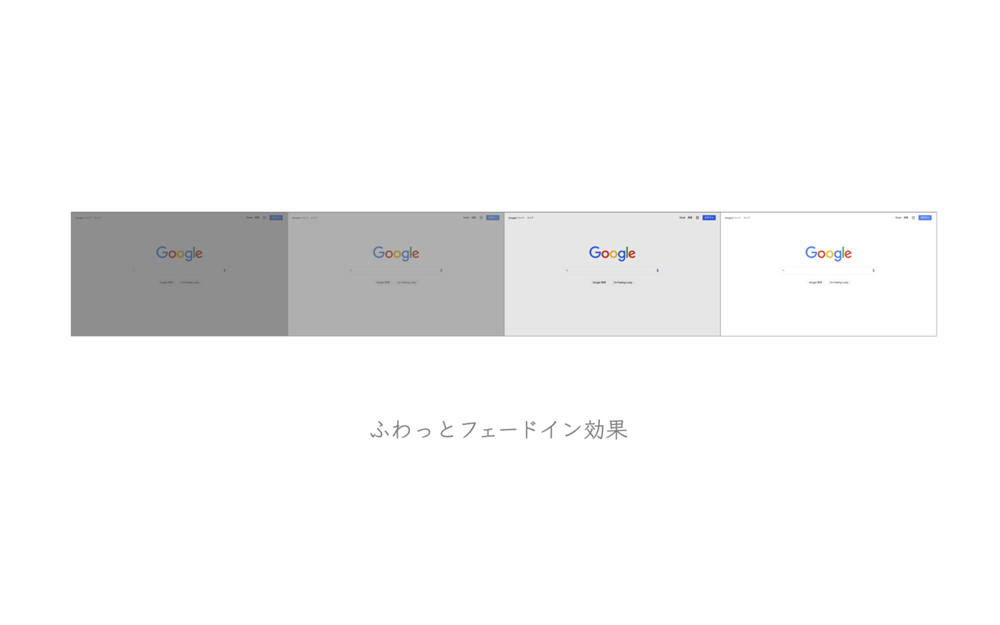

# fade-in

Chrome拡張機能。眩しさを抑えるため、ページを開く前に「ふわっ」と点灯します。

## ChromeウェブストアのURL

[ふわっとフェードイン効果 - Chrome ウェブストア](https://chrome.google.com/webstore/detail/%E3%81%B5%E3%82%8F%E3%81%A3%E3%81%A8%E3%83%95%E3%82%A7%E3%83%BC%E3%83%89%E3%82%A4%E3%83%B3%E5%8A%B9%E6%9E%9C/mdfelgjgidgnkodmjhdglbmgamlggmpf?hl=ja)

## スクリーンショット

